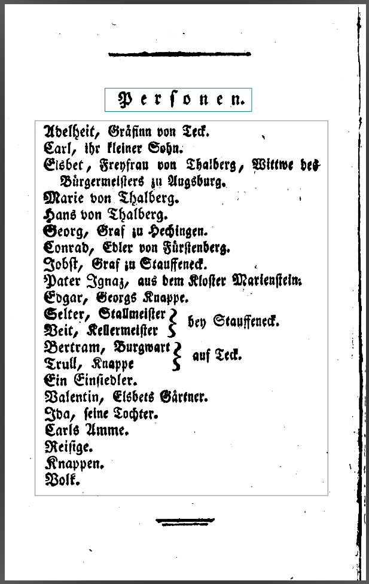
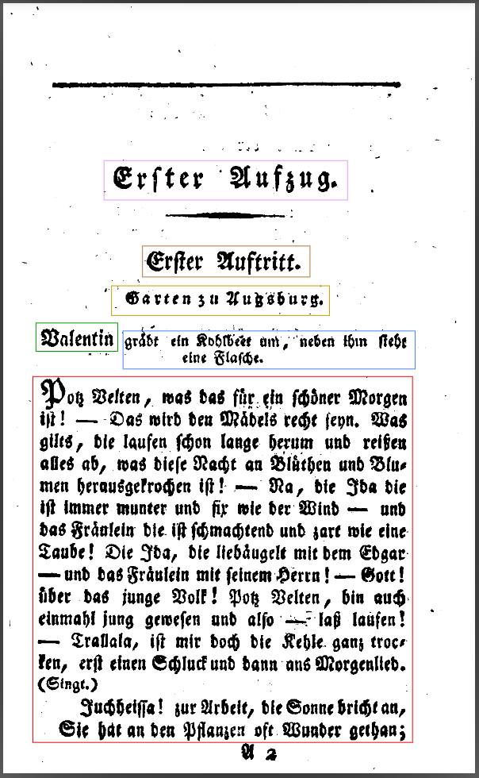
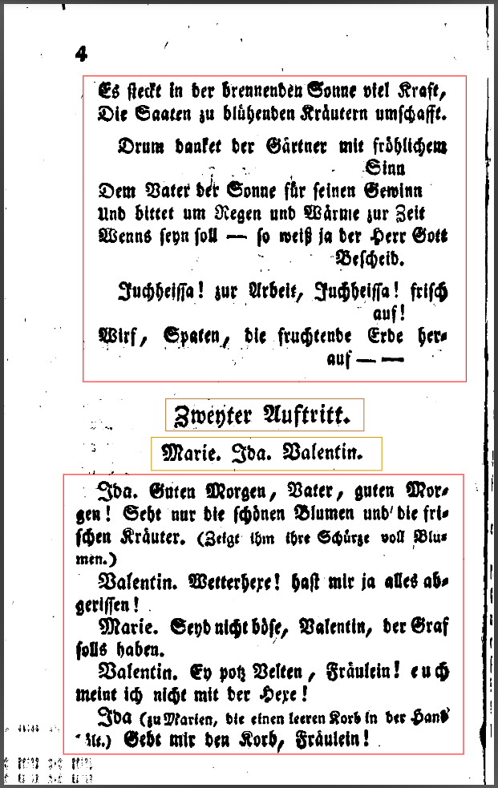

# PAGE XML Guidelines for the PAGE → EzDrama → DraCor TEI Conversion

These guidelines describe how PAGE-XML files must be structured and segmented so that the **PAGE2EzDrama2DraCorTEI** application can correctly process and convert them into TEI-encoded drama texts.

---
## Table of Contents
[1️⃣ Structure of a Valid PAGE-XML File](#1️⃣-structure-of-a-valid-page-xml-file)\
[2️⃣ Required Region Types](#2️⃣-required-region-types)\
[3️⃣ Recommended Tools for PAGE Creation](#3️⃣-recommended-tools-for-page-creation)\
[4️⃣ File Naming and Selection](#4️⃣-file-naming-and-selection)\
[5️⃣ Processing Principle](#5️⃣-processing-principle)\
[6️⃣ Additional Recommendations](#6️⃣-additional-recommendations)\
[7️⃣ Segmentation Guidelines](#7️⃣-segmentation-guidelines)

---

## 1️⃣ Structure of a Valid PAGE-XML File

Each PAGE-XML file must follow the [PAGE schema 2019-07-15](http://schema.primaresearch.org/PAGE/gts/pagecontent/2019-07-15/pagecontent.xsd).

A valid PAGE file is structured as follows:

```xml
<PcGts xmlns="http://schema.primaresearch.org/PAGE/gts/pagecontent/2019-07-15">
  <Metadata>
    <Creator>OCR4all</Creator>
    <Created>2025-06-18T16:36:44</Created>
  </Metadata>
  <Page imageFilename="0018.png" imageHeight="3508" imageWidth="2479">
    <TextRegion id="r1" type="heading">
      <Coords points="..."/>
      <TextLine id="r1_l001">
        <Coords points="..."/>
        <TextEquiv><Unicode>Vierter Auftritt.</Unicode></TextEquiv>
      </TextLine>
    </TextRegion>
    <TextRegion id="r2" type="paragraph">
      <TextLine id="r2_l001">
        <TextEquiv><Unicode>Dem der liebe Gott an feſten Knochen gab ...</Unicode></TextEquiv>
      </TextLine>
    </TextRegion>
  </Page>
</PcGts>
```
### Required structure

| Level | Element                     |Description                                                       |
| ----- | --------------------------- | ----------------------------------------------------------------- |
| 1     | `<PcGts>`                   | Root element of a PAGE file                                       |
| 2     | `<Metadata>`                | Contains creator and timestamp                                    |
| 3     | `<Page>`                    | Contains layout and text regions                                  |
| 4     | `<TextRegion>`              | Logical unit of a page (dialogue, heading, stage direction, etc.) |
| 5     | `<TextLine>`                | One line of text within a region                                  |
| 6     | `<Coords>`                  | Polygon coordinates of each region or line                        |
| 7     | `<TextEquiv>` / `<Unicode>` | The recognized text content                                       |

## 2️⃣ Required Region Types

Each PAGE file must contain properly typed TextRegion elements.
The following types are required for successful parsing:

| Region Type      | Meaning                               | Function in Drama                                       | Example                          |
| ---------------- | ------------------------------------- | ------------------------------------------------------- | -------------------------------- |
| `catch-word`     | Heading for the list of characters    | Title of the person list                                | e.g. **"Personen:"**             |
| `TOC-entry`      | Entry within the person list          | Individual character name                               | e.g. **"Georg"**, **"Adelheit"** |
| `signature-mark` | Stage direction outside the dialogue  | Scene or act markers like **"Die Scene spielt im Garten."**            |                                  |
| `credit`*         | Speaker name                          | Precedes spoken text                                    | e.g. **"Georg."**                |
| `caption`   **     | Stage direction *within* the dialogue | Parenthesized text inside lines                         | e.g. **"(lächelnd)"**            |
| `paragraph`      | Combined block                        | Contains speaker + spoken text + inline stage direction | e.g. speaker’s full speech       |
| `header`         | Act or major division                 | e.g. **"Erster Aufzug"**, **"Zweiter Akt"**             |                                       |
| `heading`        | Scene or entrance                     | e.g. **"Vierter Auftritt."**                            |                                  |

\* only used if it is not possible to nest the TextRegion within a `paragraph` \
** only used if it is not possible to nest the TextRegion within a `paragraph` or the stage direction has no brackets
### Example layout of typical regions

| Scene fragment                 | Region types involved                          |
| ------------------------------ | ---------------------------------------------- |
| *"Erster Aufzug"*              | `header`                                       |
| *"Vierter Auftritt."*          | `heading`                                      |
| *"Georg. (freudig) Sie ists!"* | `paragraph` with nested `credit` and `caption` |
| *"Die Scene spielt im Garten.", "Ende des vierten Aufzugs"*               | `signature-mark`                               |

## 3️⃣ Recommended Tools for PAGE Creation

You can generate PAGE-XML files with any segmentation or OCR pipeline that produces valid PAGE schema files.
Recommended and tested workflows include:

| Tool                 | Function                                               | Notes                     |
| -------------------- | ------------------------------------------------------ | ------------------------- |
| **[OCR4all](https://www.ocr4all.org/)**          | Full workflow (layout analysis, transcription, export) | Easiest complete solution |
| **[LAREX](https://github.com/OCR4all/LAREX) + [Calamari](https://github.com/Calamari-OCR/calamari)** | Manual segmentation + OCR                              | Lightweight alternative   |

The toolchain is not fixed — any software that outputs valid PAGE XML (2019 schema) is compatible.

## 4️⃣ File Naming and Selection

- PAGE-XML files must be numbered sequentially, starting from 0001.xml.
- Not all pages must be processed.
- The title page and empty or irrelevant pages can be omitted.
- Include:
    - The list of persons (catch-word + TOC-entry)
    - All pages with headings, scenes, and dramatic text

### Example directory structure:
```
data/
├── 0001.xml   ← title page (optional, can be skipped)
├── 0002.xml   ← person list
├── 0003.xml   ← act I
└── 0004.xml   ← act II
```
you can find an example [here](https://github.com/mrupnig/PAGE2EzDrama2DraCorTEI/tree/main/data/drama)

## 5️⃣ Processing Principle

The PAGE2EzDrama2DraCorTEI app reads all valid PAGE files, extracts TextRegion and TextLine elements, and maps them into DraCor-compatible TEI structures.

To ensure correct conversion:

- Use the region types listed above.
- Avoid unnamed or untyped regions.
- Keep each speaker’s text within one paragraph region.
- Stage directions (caption) must be separate regions or inline parenthesized text.

## 6️⃣ Additional Recommendations

| Topic                  | Recommendation                                                                                             |
| ---------------------- | ---------------------------------------------------------------------------------------------------------- |
| **Unicode characters** | Use normalized forms (e.g. `ſ`, `ʒ`, `Ʒ` will be standardized in cleanup).                                 |
| **Consistency**        | Use the same region types throughout the document.                                                         |
| **Verification**       | Validate PAGE XML with [primaresearch.org PAGE validator](https://www.primaresearch.org/tools/PAGEViewer). |
| **Image linkage**      | The `imageFilename` attribute should match the source image file.                                          |

---

## 7️⃣ Segmentation Guidelines

This section provides visual examples of how pages and text regions should be segmented before import into the **PAGE2EzDrama2DraCorTEI** application.  
Each figure illustrates a specific region type and its correct layout.


### Person List Segmentation


**Description:**  
Example of a *person list page* with regions of type  
- `catch-word` (“Personen:”)  
- `TOC-entry` for each listed character.  
The whole text block is a `TextRegion` of type `TOC-entry`.

---

### Scene Heading and Stage Setting


**Description:** 
Scene-opening page showing  
- one `header` region for the act (e.g. *Erster Aufzug*)
- one `heading` region for the scene (e.g. *Erster Auftritt*)  
- `signature-mark` regions for stage location notes such as *(Im Garten.)*
- `credit`region for speaker
- `caption`region for stage direction without brackets
- `paragraph` region for spoken text

---

### Dialogue Page with Stage Directions


**Description:**  
Page containing spoken text structured into `paragraph` regions.  
Each `paragraph` combines the speaker name (`credit`), the speech text, and any inline `caption` regions for stage directions such as “(smiling)” or “(aside)”.
Named characters at the beginning of a scene are handled as stage directions (`signature-mark`)

---
